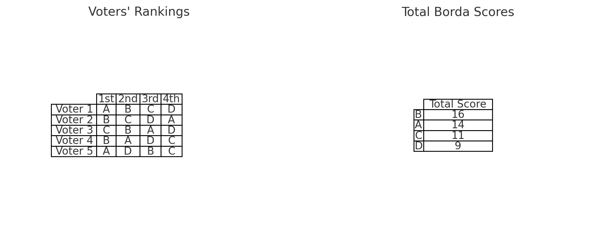

## [📹 Watch the introductory video here](https://wsdmoodle.waseda.jp/mod/quiz/view.php?id=5169770)
## Borda Count

### Introduction
In the previous session, we examined the problems inherent in plurality voting. This time, we will introduce a class of voting methods known as **scoring rules** and focus on one of the most prominent examples in this category: the **Borda Count**. While the Borda Count does not completely eliminate issues such as the spoiler effect and strategic voting, it is considered to have relatively desirable properties among scoring methods.

---

## 1. Scoring Rules

### 1.1 General Definition
A **scoring rule** is a voting system in which each voter assigns some form of **“points”** to candidates, and the winner is determined by the sum or average of those points. In many cases, voters **rank** the candidates, and points are assigned automatically based on a predefined schedule according to the voter’s ranking. For example, if there are four candidates (A, B, C, D):

- 1st place: 3 points  
- 2nd place: 2 points  
- 3rd place: 1 point  
- 4th place: 0 points  

We then add up the points from all voters and declare the candidate with the highest total score the winner.

### 1.2 Familiar Everyday Examples
- **Ranking preferred proposals in a company survey**  
  For instance, you might have three proposals—A, B, and C—and assign 2 points to the 1st choice, 1 point to the 2nd choice, and 0 points to the 3rd choice, then sum all votes. Whichever proposal gets the highest total points is adopted. This is a frequently seen example of a scoring rule.  

- **Ranking to determine top favorites in a school event poll**  
  Suppose each voter ranks multiple options—marking the one they like most as 1st, the next as 2nd, and so on—and higher ranks are assigned more points. Summing the points to decide the overall top choices is another example of a scoring rule.

### 1.3 Plurality Voting as a Special Case of Scoring
Plurality voting is a system in which voters select only their **top choice**. This can be interpreted as assigning **1 point to the top choice and 0 points to all others**. Thus, plurality voting is essentially **a special case of a scoring rule**. Even though it doesn’t appear to involve any ranking, choosing only one candidate can be seen as giving that candidate a “1st place” ranking, while every other candidate is implicitly given 0 points.

---

## 2. Borda Count

### 2.1 Definition
Among the various scoring rules, the most commonly cited example is the **Borda Count**.

1. **Voting Procedure**  
   - When there are \(n\) candidates, each voter **ranks all of the candidates**.  
   - Points are assigned in an arithmetic sequence based on the ranking: \(n-1\) points for 1st place, \(n-2\) for 2nd, …, down to 0 for last place.  

2. **Tally**  
   - Add up all the points assigned by all voters. The candidate with the highest total score is the winner.

#### Example: Four Candidates (A, B, C, D)
- 1st place → 3 points  
- 2nd place → 2 points  
- 3rd place → 1 point  
- 4th place → 0 points  

For instance, if a particular voter’s preference order is A > B > C > D, then that voter gives 3 points to A, 2 to B, 1 to C, and 0 to D. After all voters’ preferences are aggregated, the candidate with the most total points wins.

---

## 3. The Borda Count’s Merits

### 3.1 Not “Perfect,” But Strong Among Scoring Methods
Like plurality voting, the Borda Count cannot completely avoid issues like the **spoiler effect** or **strategic voting**. Nonetheless, it is considered relatively superior within the broader category of scoring rules for the following reasons:

- **Evenly spaced point differences for each rank**  
  As you move down the ranking—1st to 2nd, 2nd to 3rd, and so on—each step is just 1 point apart. This is said to capture a voter’s “gradual differences in preference” in a balanced way.  
- **Less distortion compared to scoring methods with extreme point distributions**  
  For instance, if a system gave 10 points for 1st place and 0 points for all others, it would closely resemble plurality voting, inheriting the same pitfalls of spoiler effects and strategic voting. The Borda Count softens such extremes by distributing the points more evenly.

### 3.2 The Only Scoring Rule That Avoids Electing a Condorcet Loser
A **Condorcet loser** is a candidate who “would lose in a one-on-one contest against every other candidate.” Intuitively, such a candidate should never win because they are less preferred than all other candidates. However, some voting systems can end up electing this kind of candidate.

- The Borda Count is reputed to be the only scoring rule that ensures a Condorcet loser never wins.  
- However, it does **not** guarantee electing a Condorcet winner, nor does it completely prevent spoilers or strategic voting. It is, at best, **relatively** better within the family of scoring rules.

---

## 4. Interpreting Borda Scores

In the Borda Count, the ranking given by a voter can be understood as indicating **how many votes that candidate would get in head-to-head matchups** against the other candidates. Let’s make this concrete by considering an example with four candidates (A, B, C, and D).

### 4.1 Imagining All Possible One-on-One Matchups
First, imagine separate one-on-one elections for each pair of candidates: A vs. B, A vs. C, A vs. D, B vs. C, B vs. D, and C vs. D.

- **How the majority vote is conducted**  
  Each voter checks which candidate they have ranked higher and casts a vote for that candidate in the head-to-head matchup.

### 4.2 Example for One Voter
Assume one voter’s preference order is:
\[
A \succ B \succ C \succ D
\]
This voter’s head-to-head votes would go as follows:

1. (A vs. B) → 1 vote for A  
2. (A vs. C) → 1 vote for A  
3. (A vs. D) → 1 vote for A  
4. (B vs. C) → 1 vote for B  
5. (B vs. D) → 1 vote for B  
6. (C vs. D) → 1 vote for C  

In total, the voter has given A 3 votes, B 2 votes, C 1 vote, and D 0 votes across all pairwise contests. This is exactly the same as **assigning 3 points to A, 2 points to B, 1 to C, and 0 to D** in a Borda Count system.

### 4.3 Summation Across All Voters and Pairs Equals the Borda Score
The above is just for one voter. But if you **count the pairwise votes** from **all voters** across **all candidate pairs**, you get:

- The total number of “head-to-head votes” for A  
- The total number of “head-to-head votes” for B  
- The total number of “head-to-head votes” for C  
- The total number of “head-to-head votes” for D  

These totals will be **exactly the same** as the total points each candidate receives under the Borda Count (where 1st place = \(n - 1\) points, 2nd place = \(n - 2\), etc.).

- Put another way, **when you tally how many votes each candidate wins in all pairwise matchups across all voters, you effectively compute their Borda scores**.

### 4.4 Summary
- **A voter’s ranking essentially indicates which candidate the voter would choose in each pairwise matchup.**  
- **The arithmetic progression of \((n-1)\) points, \((n-2)\) points, etc. in the Borda Count can be viewed as a simplified way of counting all those pairwise votes at once.**  
- **In the end, summing up every vote in every head-to-head matchup for every voter will match the Borda points.** Thus, we can see Borda scoring as a kind of “aggregate evaluation of all pairwise contests.”

---

## 5. Ranking All Candidates Is Burdensome
Implementing the Borda Count requires voters to **rank every candidate**. When there are many candidates, this can lead to:

- Cumbersome ranking tasks  
- Increased risk of errors in marking ballots  
- Frustration among voters who “don’t really know the differences between all these candidates”  

As a result, voters may find it quite burdensome, posing a significant practical challenge in real-world applications.

---

## 6. Conclusion and Future Directions

- **What are scoring rules?**  
  - A class of voting methods in which points are assigned to each candidate, and the candidate with the highest (or average) points wins.  
  - Plurality voting can be seen as a special case of scoring rules in which the top choice gets 1 point and all others get 0 points.

- **Characteristics of the Borda Count**  
  - When there are \(n\) candidates, voters assign \(n-1\) points to their 1st choice, \(n-2\) to their 2nd, and so on.  
  - It is the only scoring rule that ensures a Condorcet loser cannot win.  
  - Although it cannot fully eliminate the spoiler effect or strategic voting, it has comparatively favorable properties within the scoring family.

- **Interpreting Borda scores**  
  - The points derived from a ranking can be seen as a simplified count of how many head-to-head matchups each candidate would win against every other candidate.  
  - Consequently, the candidate who is broadly favored in pairwise comparisons accumulates more points.

- **The burden of ranking all candidates**  
  - A practical disadvantage of the Borda Count is the heavy burden placed on voters.

Moving forward, we will look more closely at other methods within the scoring framework, along with the issues—like strategic voting and the spoiler effect—that the Borda Count does not completely resolve. We will also compare **Approval Voting** and **Majority Judgment**, which belong to different frameworks, and consider the strengths and weaknesses of each method in a more comprehensive manner.
### [📝 Take the mini-quiz here](https://wsdmoodle.waseda.jp/mod/quiz/view.php?id=5169770)

