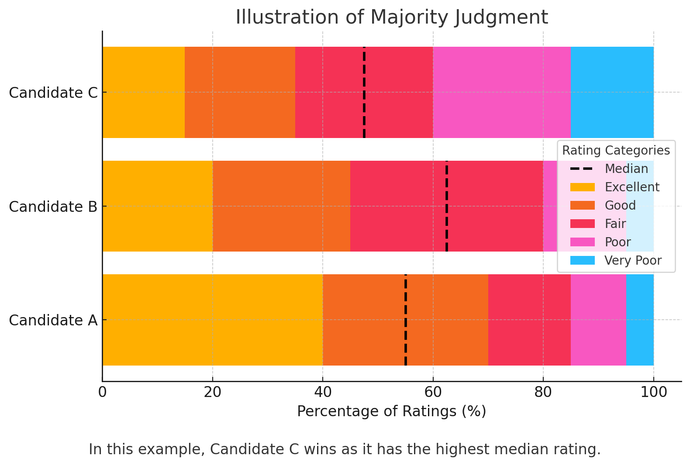

## [📹 Watch the introductory video here](https://wsdmoodle.waseda.jp/mod/quiz/view.php?id=5169768)
## Other Fascinating Rules

So far, we have looked at relatively simple voting systems like the Borda Count and Approval Voting. However, there are other approaches that aim to reflect voters’ preferences in even richer ways. Below, we introduce two noteworthy methods: **Range Voting** and **Majority Judgment (MJ)**.

---

## 1. Range Voting

### 1.1 What Is Range Voting?
**Range Voting** is a system in which each voter assigns a **numerical score** to every candidate. Typically, there is a fixed range (such as 0–5 or 0–10), and voters assign any number within that range to each candidate.

- **How it works**  
  For example, a voter might give Candidate A 5 points, Candidate B 3, Candidate C 0, and Candidate D 10, thereby expressing preferences via numeric values.  
- **Tally**  
  The winner is determined by calculating the **average (or total) score** each candidate receives. The candidate with the highest score wins.

### 1.2 Advantages of Range Voting
- **Freedom to express preference intensity**  
  Unlike the Borda Count, which mechanically assigns ranks (1st, 2nd, 3rd, etc.), voters can differentiate “I somewhat like A, but don’t adore them, so I’ll give 5 points,” or “I think B is acceptable, so I’ll give 3,” and so forth.  
- **High informational potential if voters are sincere**  
  Because each candidate receives a score that directly reflects the degree to which a voter likes or dislikes them, this system can, in theory, provide very detailed information for reaching a social consensus.

### 1.3 Weaknesses of Range Voting
- **Differences in how voters interpret scores**  
  One voter’s “5 points” may mean something different from another voter’s “5 points.” It’s not easy to compare these scores uniformly—someone who gave 5 might see that as relatively high, while someone else might consider 5 an average, middling rating.  
- **Heightened vulnerability to strategic voting**  
  In Range Voting, it’s easy for a voter to say, “I actually think this candidate deserves a 5, but I’ll give them a 10 to boost their chances,” or “I might give them a 2, but I’ll go down to 0 so they can compete better against someone I dislike.” As a result, there can be weak incentives for voters to state their true preference intensity.

---

## 2. Majority Judgment (MJ)

### 2.1 What Is MJ?
**Majority Judgment (MJ)** also uses **multi-level evaluations**, similar to Range Voting, but instead of using **numerical scores**, it uses **verbal labels** (for example, “Excellent,” “Good,” “Fair,” “Poor,” “Terrible”), which is a distinctive feature.

- **How it works**  
  Voters assign a label from a predefined set (e.g., “Excellent,” “Good,” “Average,” “Poor,” “Terrible”) to each candidate.  
- **Tally**  
  All the labels assigned to each candidate are collected, and the winner is the candidate whose **median label** (the label that lies at the 50% mark in the distribution of assigned labels) is the highest.  
  - Concretely, you list out all the labels each candidate received and identify the label at the position just over 50%. That label represents the candidate’s **median** (central) evaluation.

### 2.2 Differences from Range Voting

1. **Words rather than numbers**  
   - While Range Voting asks voters to provide a numerical score (e.g., 0–10), MJ asks them to select one label from a set of descriptive terms.  
   - This can alleviate some issues with the **“absolute meaning”** of numeric scores—where one person’s “5” might differ greatly from another’s—by providing a common set of categories (although it’s not a perfect fix).

2. **Uses the median rather than the mean**  
   - Range Voting generally uses the average (or total) score. MJ, on the other hand, focuses on the candidate’s **median** label.  
   - The advantage of using a median is that it’s **less influenced by extreme values**. Even if a small group awards excessively low or high labels, shifting the overall median requires a larger portion of voters to use the same extreme label, making strategic manipulation more difficult.

### 2.3 Merits of MJ
- **Easier to share common understanding of evaluations**  
  While people may interpret “5 points” differently, terms like “Good,” “Average,” or “Poor” might foster a slightly better mutual understanding (though complete consensus on meaning is not guaranteed). In practice, many find it more intuitive to work with a set of verbal labels than numeric scales.  
- **Somewhat resistant to strategic manipulation**  
  Because MJ relies on the median rather than the average, it’s less swayed by extreme ratings. Even if a minority repeatedly assigns “Excellent” or “Terrible,” it won’t significantly shift the median unless a large enough number of voters give the same label.

---

## 3. Summary and Outlook

- **Range Voting**  
  - **Merits**: Voters can freely express the intensity of their preferences, which (ideally) can offer a highly accurate reflection of each voter’s true sentiments.  
  - **Weaknesses**: Differences in how numeric scores are interpreted can be substantial, and the system is prone to strategic “inflation” or “deflation” of scores.

- **Majority Judgment (MJ)**  
  - **Merits**: Uses labels and a median-based tally, making it less susceptible to extreme strategic manipulation.  
  - **Weaknesses**: There’s no guarantee that everyone interprets the labels the same way; introducing and explaining the labels requires careful design and voter education.

All of these methods aim to **capture multiple layers of voter preferences**, potentially collecting more information than single-choice systems like plurality or Approval Voting. However, they also pose **practical challenges**, such as increased complexity for voters and the impact of strategic voting. 

In the future, we need to further examine how to implement such complex evaluation systems effectively: under what circumstances their benefits outweigh the downsides, how to mitigate the burden on voters, and which designs best address strategic concerns. By doing so, we can compare the pros and cons of each system and consider which methods are best suited for specific contexts.
### [📝 Take the mini-quiz here](https://wsdmoodle.waseda.jp/mod/quiz/view.php?id=5169768)

