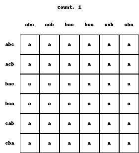

## [📹 Watch the introductory video here](https://wsdmoodle.waseda.jp/mod/quiz/view.php?id=5169764)
# Social Choice Rules

## 1. Interpreting Voting Rules as Functions

In social choice theory (or voting theory), we consider a rule that aggregates each voter’s **preference** over a set of options \(X\) and then determines a single choice.

- Since it is called a “rule,” it must **uniquely determine which option is chosen under any possible situation**.  
- Mathematically, we require a well-defined correspondence from the **domain** (the set of all possible situations, i.e. all combinations of voters’ preferences) to the **codomain** (the ultimately chosen option).  
- In other words, this “voting rule” can be represented as a **function** from “domain \(\to\) codomain.”

In this lecture, we often call this a **social choice rule**, but it is essentially the same concept as a “voting aggregation rule.”

---

## 2. Preference Profiles

### 2.1 Structure of the Domain

Consider a situation in which there are \(n\) voters, each casting a vote in the form of a **preference** over the set of options \(X\). Here:

- As discussed in the previous lecture, a **preference** is a complete and transitive ordering of all pairs of options in \(X\), determining which option is more desirable or if they are equally desirable.
- A specific “situation,” also called a **preference profile**, can be expressed as a list of every individual’s preference.

For example, if \(X = \{a, b, c\}\) and there are two voters (voter 1 and voter 2):

- Let \(\succ_1\) be voter 1’s preference,  
- Let \(\succ_2\) be voter 2’s preference.

A particular situation could be written as:

\[
(a \succ_1 b \succ_1 c) \quad\text{and}\quad (c \succ_2 b \succ_2 a),
\]

meaning that voter 1 ranks \(a\) as their most preferred option, while voter 2 ranks \(c\) as their most preferred.

### 2.2 Number of Preference Profiles

- **Strict Preferences (no indifference)**  
  For instance, if \(X = \{a, b, c\}\), there are 6 total strict preferences (these correspond to the 6 permutations of three elements).  
  - If there are only two voters, then there are \(\underline{6} \times \underline{6} = 36\) possible preference profiles.  
  - Concretely, each voter’s preference can be any of the 6 possible strict orderings; for two voters, that yields \(6 \times 6 = 36\) possible situations.

- **Preferences with Indifference**  
  For \(X = \{a, b, c\}\), we already know there are 13 total preferences (all complete and transitive binary relations, including possible ties).  
  - With two voters, there are \(\underline{13} \times \underline{13} = 169\) possible preference profiles.  
  - With three voters, \(\underline{13}^3 = 2197\) profiles, and so on; the number grows rapidly as the number of voters increases.

The set of all such “combinations of all voters’ preferences” is treated as the **domain** of the voting rule (or social choice rule).

---

## 3. Definition of a Social Choice Rule

### 3.1 A Rule Is a Function

A **social choice rule** (or simply a **choice rule**) is:

> A **function** that assigns one “choice” (the **codomain**) to each of the “all possible preference profiles” (the **domain**).

- In other words, for any given voting situation (the combination of all voters’ preferences), the rule must determine **which element of \(X\)** is chosen.  
- We call it a “rule” precisely because this correspondence is clearly defined and **unique**.

### 3.2 Example: Counting the Total Number of Rules

A **rule** is an assignment of an element from the codomain (the set of options) to every element of the domain (the set of all possible preference profiles). Hence, if we want to count how many distinct rules there are:

- The number depends on the size of the **domain** (all possible preference profiles) and the size of the **codomain** (the set of options).
- Specifically, you get an exponential structure: for each element of the domain, you can assign any of the elements in the codomain.

#### (1) Strict Preferences over \(\{a,b,c\}\) with Two Voters

- The domain (all preference profiles) has size **36** (as mentioned above).  
- The codomain (\(\{a,b,c\}\)) has size 3.  
- Therefore, there are **\(3^{36}\)** possible social choice rules.  
  - Each of the 36 distinct voting situations can be mapped to one of the three options (\(a\), \(b\), or \(c\)), yielding \(3^{36}\) different mappings overall.

#### (2) Preferences Including Indifference

- The domain (all preference profiles) is larger: for two voters, **169** possible profiles; for three voters, **2197** profiles, and so on.  
- For two voters, that means there are \(3^{169}\) ways to map each profile to one of the three options.  
- As the number of voters \(n\) grows, the exponent explodes correspondingly.

---

## 4. Summary and Logical Significance

1. **A Social Choice Rule Is a Function**  
   - In voting theory (social decision-making), one must uniquely specify “which outcome is chosen” (the codomain) for **every possible voting situation** (the domain).  
   - As a result, the rule can be precisely defined in the form of a **function**.

2. **An Enormous Number of Possibilities**  
   - A rule can be formed by assigning a possible outcome to **every** domain element (every possible situation).  
   - Even in a small case with three options \(\{a,b,c\}\) and two voters, “strict preferences only” yields \(3^{36}\) rules, while allowing indifference yields \(3^{169}\). This is already huge.

3. **Why So Many?**  
   - There is a large number of possible preference profiles (the domain).  
   - For each situation, you can freely choose among three outcomes, so the total grows exponentially.

4. **The Theoretical Perspective**  
   - With this vast set of possible rules, social choice theory asks which properties (axioms) a desirable rule ought to satisfy.  
   - In the upcoming lectures, we will examine whether rules satisfying certain axioms (e.g., Pareto criteria, unrestricted domain) exist, and if they do, what characteristics they possess.

---

This concludes the basic explanation of how a social choice rule is defined as a function. As shown, there is a tremendous range of possible rules, and **which rule properties to demand** becomes a central question moving forward.
### [📝 Take the mini-quiz here](https://wsdmoodle.waseda.jp/mod/quiz/view.php?id=5169764)

