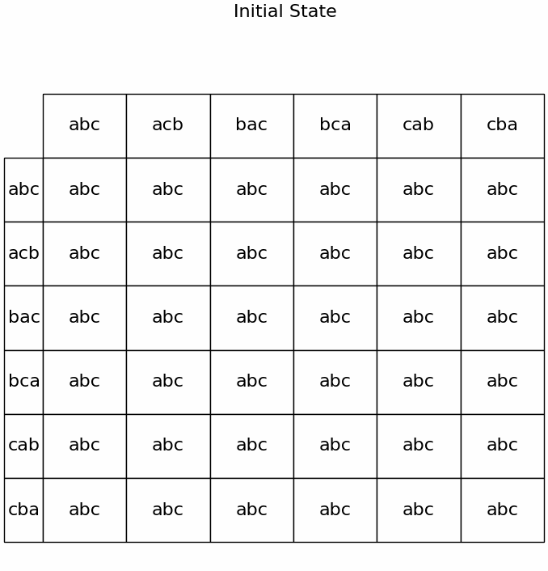

## [📹 Watch the introductory video here](https://wsdmoodle.waseda.jp/mod/quiz/view.php?id=5169763)
# Strategy-Proofness

## 1. Can Strategic Manipulation Be Completely Prevented?

When designing a social choice (voting) rule, a frequent concern is **preventing each voter from misrepresenting their “true preference” to gain an advantage** (a strategic manipulation).  
- Ideally, we want to ensure that “under no circumstances can a voter benefit by lying.”  
- However, **if the set of options \(X\) has at least 3 elements**, **there are at least 2 voters**, and the domain of the rule is broad enough to allow **all possible strict (indifference-free) preferences** to be cast, then it is impossible to design a choice rule that completely prevents strategic manipulation (given certain other properties).** This is essentially the statement of the **Gibbard–Satterthwaite theorem**.

---

## 2. The Condition: Strategy-Proofness

### 2.1 Definition (Intuitive View)

A voting rule \(f\) is said to be **strategy-proof** if **no voter can obtain a more preferred outcome by misrepresenting their true preference**.

- **Formally**:  
  - Let the set of voters be \(\{1,2,\dots,n\}\), the set of options be \(X\), and each voter \(i\) have a “true preference” denoted \(\succsim_i\).  
  - A voting rule \(f\) is a function that, given a profile \((\succsim_1, \succsim_2, \dots, \succsim_n)\), selects a single element of \(X\).  
  - **Strategy-proofness**: For every voter \(i\), every true preference \(\succsim_i\), and every preference profile of the other voters \(\succsim_{-i}\), if voter \(i\) were to submit a false preference \(\succsim'_i\), then  
    \[
      f(\succsim_i,\succsim_{-i}) \;\succsim_i\; f(\succsim'_i,\succsim_{-i}),
    \]
    meaning the outcome chosen when \(i\) reports their true preference is **at least as good** as the outcome they would get by lying.

If this condition holds, then voters have **no incentive to manipulate**, and we say the voting system cannot be “distorted” by strategic voting.

---

## 3. Example: Plurality Rule with 3 Candidates (a, b, c) and 3 Voters

Consider a voting rule where each voter names **only their top choice**, and the candidate with the most “first-place votes” is elected (a simple plurality rule). For simplicity, assume that if two or more candidates tie for the most votes, we use a tiebreak mechanism.  
- In this system, only the candidate listed first by each voter matters. If a voter fears their most disliked candidate will win, they might rank their “second favorite” in first place to prevent the worst outcome from winning.  
- A classic scenario: “If I vote honestly for my top choice \(a\), then \(c\) might win. But if I vote for \(b\) (my second choice), \(b\) will defeat \(c\). Since I prefer \(b\) over \(c\), it’s better to switch my top vote to \(b\).”

### Relationship to Strategy-Proofness

Since voters may **submit a false first choice** to prevent the “worst candidate” from winning, it is clear that **the plurality rule is not strategy-proof**.  
- “If there exists an opportunity for strategic manipulation, the rule is not strategy-proof.”  
- Indeed, in actual elections using plurality, strategic voting is often observed for precisely this reason.

---

## 4. Impossibility (Gibbard–Satterthwaite Theorem)

### 4.1 Unanimity and Dictatorship

Two basic concepts appear in the simplified explanation of the **Gibbard–Satterthwaite theorem**:

1. **Unanimity**  
   - If all voters prefer a candidate \(x\) over every other candidate (i.e., everyone ranks \(x\) at the top), then the rule must choose \(x\).  
   - Intuitively, “If everyone ranks A first, it would be strange for the rule to choose B.”

2. **Dictatorship**  
   - A voting rule is **dictatorial** if the outcome depends solely on a single voter’s preference (the “dictator”), with no influence from the others.  
   - Concretely, the final outcome always matches the top choice of the dictator.

### 4.2 Statement of the Gibbard–Satterthwaite Theorem

> **Theorem**: Suppose there are at least 3 options in the set \(X\) and at least 2 voters, and the domain of a social choice rule includes at least all strict (indifference-free) preferences.  
> If a social choice rule satisfies both **unanimity** and **strategy-proofness**, then **it must be dictatorial**.

**Interpretation**:  
- If we want a rule to completely prevent strategic manipulation (strategy-proofness) and also ensure that “if everyone favors the same candidate, that candidate wins” (unanimity), then **the only possibility is a dictatorship**.  
- Any rule that accounts for other voters’ opinions inevitably opens the door for strategic voting—an extremely strong impossibility result.

---

## 5. A Brief Logical Sketch

### 5.1 Illustration in the Case of 2 Voters and 3 Candidates

The proof of the **Gibbard–Satterthwaite theorem** is generally quite involved. Nonetheless, a helpful starting point is to imagine the scenario with **3 candidates \(\{a, b, c\}\)** and **2 voters (voter 1 and voter 2)**, assuming **strict preferences** (no ties).  
- The domain of possible profiles is \(6 \times 6=36\), since each of the 2 voters can have any of the 6 possible strict rankings of \(\{a,b,c\}\).  
- The rule \(f\) assigns one of \(\{a,b,c\}\) to each of the 36 possible situations, i.e., \(f(\succsim_1,\succsim_2)\in\{a,b,c\}\).

### 5.2 Three Observations from Strategy-Proofness

Assume the rule is strategy-proof (SP).  
Start from a profile **P** whose outcome is **t**.  
Pick voter *k* and the two *adjacent* names in her true ranking, written *(x above y)*.  
Create **P′** by swapping them while every other report stays unchanged.

---

**Step 1 (x ≠ t, y ≠ t)**  
In **P** the pair lies wholly either above **t** or below **t**; the swap does not change that fact.  
If the rule could move the outcome past the pair in **P′**—to *x, y,* or any candidate on the opposite side of **t**—then between **P** and **P′** there would be a profile where *k* strictly gains and none where she loses, contradicting SP.  
Hence **P′** must keep the outcome **t** and the swapped cell becomes *{ t }*.

**Step 2 (y = t)**  
Swapping lifts **t** one place and never lowers it.  
Any result other than **t** would strictly reward the deviation, so the swapped cell again collapses to *{ t }*.

**Step 3 (x = t)**  
Write *z* for the one alternative not in the adjacent pair.  
In **P** either *z* is strictly preferred to **t** or **t** is strictly preferred to *z*; the swap leaves that strict order intact.  
If the rule allowed *z* to win in **P′**, the voter would end up strictly better off whenever she prefers *z* to **t**, and never worse otherwise—another SP violation.  
Therefore *z* must be removed from the swapped cell, leaving at most *{ t, y }*.

---

Repeating these three local restrictions over every adjacent pair sends the SP condition through the entire grid and ultimately forces every profile to a single manipulation-proof outcome.

[Download Video (MP4)](assets/images/GStheorem.mp4){ download }

### How to read the animation

Each frame is a **6 × 6 grid of preference profiles**.

* **Rows** list Agent 1’s rankings in the order  
  `(a b c) , (a c b) , (b a c) , (b c a) , (c a b) , (c b a)`.  
* **Columns** list the same six rankings for Agent 2.  
* The entry at position *(i,j)* is the *current candidate set* the algorithm still allows for the profile  
  `⟨ orders[i] , orders[j] ⟩`.

---

#### Symbols inside a cell  
`abc` all three names are still possible  
`ab` only *a* or *b* remain  
`a`  outcome already fixed to *a*

---

#### What the frame sequence shows  

1. **Initial frame** Every cell starts with `{a,b,c}`.  
2. **Unanimity** Whenever both agents rank the same top choice the algorithm fixes that cell immediately; you will see 12 single–letter cells appear.  
3. **Elimination passes**  
   * *Step 1* Title “Step 1: … swap(x,y)”.  Because neither *x* nor *y* is the current winner **t**, the swapped cell is forced to `{t}`.  
   * *Step 2* `y = t` → swapped cell also collapses to `{t}`.  
   * *Step 3* `x = t` → the unique third alternative *z* is deleted, so a two-letter set shrinks to one.

The grid stops changing when every profile shows a single letter.  
If some cells still display two letters the program “branches” once, fixes one of them arbitrarily, and repeats the same three steps until everything is settled.  

Finally, scan any row or column: if the same letter appears everywhere, that reveals the dictator picked out by the Gibbard–Satterthwaite theorem.

---

## 6. Summary

1. **Strategy-Proofness** is the property that “no voter can benefit by lying.”  
2. As seen in the example of 3 voters using a plurality rule with 3 candidates, there is room for strategic voting, meaning it is **not** strategy-proof.  
3. **Gibbard–Satterthwaite Theorem**:  
   - With 3 or more candidates, a rule that satisfies unanimity and strategy-proofness must be **dictatorial**.  
   - In other words, if the domain is sufficiently large to allow “all strict preferences,” **it is impossible** to eliminate strategic manipulation entirely and still have a “democratic” rule that respects unanimity.

This strong impossibility result sits at the core of voting theory: there is no rule that **completely** excludes strategic manipulation while also **respecting unanimous support** if there are at least 3 candidates and 2 or more voters. The next step is to explore potential workarounds, such as restricting the domain (e.g., single-peaked preferences) or partially mitigating strategic voting.
### [📝 Take the mini-quiz here](https://wsdmoodle.waseda.jp/mod/quiz/view.php?id=5169763)

