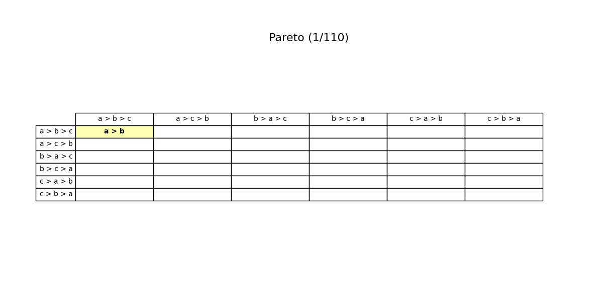

## [📹 Watch the introductory video here](https://wsdmoodle.waseda.jp/mod/quiz/view.php?id=5169762)
# The Spoiler (Vote-Splitting) Problem

## 1. Reversal Caused by an Increase in Options

In voting or social decision-making, the term **“spoiler (vote-splitting) problem”** refers to the phenomenon where **the entry of a new candidate causes a losing candidate to become the winner**.
- Example: When there were only two candidates, B would have won. But when a new candidate C joins, the vote gets split in such a way that A ends up winning.
- It is known that, as long as the voting method allows sufficiently diverse voting formats (at least all strict preferences without indifference), there is **no choice rule that can completely eliminate** this spoiler problem.

Here, we will first clarify the condition called “independence of irrelevant alternatives,” then see how combining it with transitivity (a requirement for rational choice) leads to difficulties.

---

## 2. Independence of Irrelevant Alternatives (IIA)

Let \(X\) be the set of all potential options, and let \(X' \subseteq X\) be the subset of options that actually appear in an election. Voters have preferences over \(X\) internally, but in practice, they often only submit information about the subset \(X'\) that matters for this vote.

Specifically, consider a two-candidate race \(\{a,b\} \subset X\):

- Voters express only which of \(a\) or \(b\) they prefer.  
- **Independence of irrelevant alternatives (IIA)** requires that the result of the choice between \(a\) and \(b\) is unaffected by any changes in voters’ evaluations of other candidates \(c\).  
  - In other words, if the relative ranking of \(a\) vs. \(b\) stays the same, then adding or removing other candidates—or changing how they are rated—does not alter the outcome of \(a\) vs. \(b\).

---

## 3. Transitivity for Rational Choice

### 3.1 Consistency When Dealing with Multiple Candidates

How can we consistently choose from a set \(X'\) containing three or more candidates based on pairwise judgments?

- As discussed under “Rationality and Preference,” a common approach is to rely on **transitive preferences** to make a consistent choice:
  - If there are no cycles (e.g., \(a \succ b\), \(b \succ c\), \(c \succ a\)) and the preference is complete, one can rank all candidates in \(X'\) and simply pick the top-ranked candidate.
- Under the assumption of **independence of irrelevant alternatives**, we want each pairwise outcome to be independent of the other candidates, and, moreover, from these pairwise outcomes we desire a **transitive overall preference**—an ideal form of “rationalization.”

### 3.2 Hope for Avoiding the Spoiler Problem

One might hope that as long as the rule consistently uses “transitive” criteria, we could avoid the problem of “the winner flipping when a new candidate is introduced.”
- However, as we will see in the next section, it turns out to be extremely difficult to satisfy both **independence of irrelevant alternatives** and **transitive consistency** in a single voting rule.

---

## 4. The Voting Paradox

To simplify, consider a method that uses **simple majority voting** for each pair of candidates. When there are three or more candidates \( \{a, b, c\} \), certain preference profiles can give rise to a well-known **cycle**:

- Under a particular distribution of voter preferences, it might happen that
  \[
     a \succ b,\quad b \succ c,\quad c \succ a
  \]
  all hold at the same time.
- This means that in pairwise terms,
  \(\displaystyle a \succ b \succ c \succ a\),
  creating a circular preference that cycles indefinitely.

Such a situation—**pairwise outcomes are clearly decided, yet they fail to be transitive**—is called the **voting paradox**.

- Once we have **three or more** candidates, pairwise comparisons by simple majority can produce these cycles.
- As long as a cyclic structure is present, there will inevitably be scenarios in which **the voting result is not consistent** when another candidate is introduced. That is, the spoiler (vote-splitting) problem cannot be avoided.
  - Concretely, if there were only two candidates, B might be the winner, but once a third candidate C appears and “splits” some portion of the votes, A could become the winner, exemplifying the typical “reversal” scenario.

---

## 5. Arrow’s Impossibility Theorem

The above voting paradox under pairwise majority voting, which attempts to enforce **independence of irrelevant alternatives** and **transitivity** (i.e., a “goal-oriented rationalization”), can be seen as a classic and particular example of **Arrow’s impossibility theorem**.

- **Unanimity** (If everyone ranks a certain candidate top, that candidate must be chosen)  
- **Independence of irrelevant alternatives**  
- A **rational** choice that incorporates **transitivity**  
- A sufficiently large domain of preferences (at least all strict ones are possible to vote on)

When we try to have a social choice rule satisfy all these simultaneously,  
> We end up concluding that the rule must **ignore unanimous preferences on most pairs** or become a **dictatorship** (reflecting only one person’s preference),  
the essence of **Arrow’s impossibility theorem**.

Thus:

- Avoiding the spoiler problem,  
- Maintaining independence of irrelevant alternatives and transitivity,  
- Respecting unanimity,

and combining these seemingly “natural” axioms is **extremely difficult**. Under many voting rules (including simple majority), similar contradictions inevitably arise. This highlights an important fundamental challenge in designing voting or social decision procedures.

### 5.1 Illustration of Three-Alternative-Two-Voter Case
Each animation frame shows a **6 × 6 grid of preference profiles** for three alternatives (a, b, c) and two voters.  
*Rows* list voter 1’s complete ranking; *columns* list voter 2’s.  
Thus the cell at row “a > b > c” and column “b > c > a” stands for the profile ⟨a b c | b c a⟩.

#### Reading a cell  
The lines inside a cell record the social rule’s current pairwise verdicts.  
If all three comparisons appear—  
```
a > b
b > c
a > c
```  
—the rule has produced a full, transitive social order (here a > b > c).  
One or two lines mean the order is still partial.

#### Colour signals  
* **Yellow** marks any cell updated in the present step.  
* During an **IIA** step, the **red** cell is the profile whose pairwise decision is being **copied** to yellow cells that share the same two individual comparisons.

#### Step labels  
* **Pareto** – yellow cells have just adopted a comparison unanimously favoured by both voters in that profile.  
* **IIA** – the red cell’s pairwise ranking has been duplicated in each yellow cell, illustrating Independence of Irrelevant Alternatives.  
* **Transitivity** – yellow cells have closed a logical gap: whenever the rule already had a > b and b > c, it now adds a > c.

By following the yellow highlights from frame to frame, you can watch these local consistency requirements propagate through the grid.  Partial rankings gradually become complete, demonstrating how Arrow’s axioms systematically constrain any social-welfare function profile by profile.



[Download Video (MP4)](assets/images/Arrow.mp4){ download }


### [📝 Take the mini-quiz here](https://wsdmoodle.waseda.jp/mod/quiz/view.php?id=5169762)

