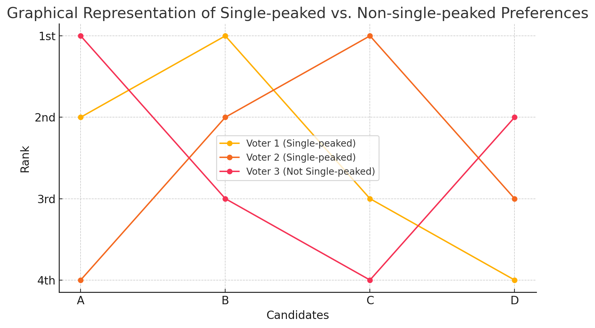

## [📹 Watch the introductory video here](https://wsdmoodle.waseda.jp/mod/quiz/view.php?id=5169765)
# Pairwise Majority Rule and the Condorcet Criterion

## 1. Characterizing Majority Rule

### 1.1 Justification in the Two‑Alternative Case

When there are only two alternatives, A and B, “simple majority rule” is often employed.  In fact, majority rule is the **unique** decision rule that satisfies all three properties below; this is known as **May’s Theorem**.

1. **Neutrality**  
   - Intuitive definition: the rule is not biased toward any particular candidate label.  
   - Example with A and B: if A wins under some profile of ballots, then swapping the labels of A and B in that same profile must make B win.

2. **Anonymity**  
   - Intuitive definition: the outcome depends only on the multiset of votes, not on *who* cast them.  
   - Example with A and B: permuting voters (shuffling their IDs) must not change the result.

3. **Positive Responsiveness**  
   - Intuitive definition: if candidate X is at least tied, and *one* ballot changes in a way that is strictly more favorable to X, then X must strictly win.  
   - Example with A and B:  
     - If A and B are tied and one voter changes a tie or a B‑over‑A ballot to A‑over‑B, then A must become the winner.  
     - If A is already ahead of B and an additional vote favorable to A appears, A must still win.

**May’s Theorem**: simple majority rule is the only decision rule for two alternatives that satisfies Neutrality, Anonymity, and Positive Responsiveness simultaneously.

---

## 2. The Condorcet Criterion

### 2.1 Basic Idea

If majority rule is desirable for two alternatives, it is natural to extend that intuition:  
- **Condorcet Criterion**  
  > If some alternative \(X\) defeats every other alternative in pairwise majority contests, society should choose \(X\).

Such an alternative is called a **Condorcet winner** or **pairwise majority winner**.

### 2.2 When a Pairwise Winner Does Not Exist

Cycles can occur (A beats B, B beats C, yet C beats A).  In such cases no pairwise majority winner exists, and the Condorcet criterion yields no social choice—its well‑known weakness.

### 2.3 The Borda Rule Violates the Condorcet Criterion

Even the **Borda rule** (a scoring rule where voters rank candidates and higher ranks receive more points) can fail to select a Condorcet winner.  A compact numerical example illustrates this.

#### Concrete Example (3 Candidates, 5 Voters)

| # Voters | 1st | 2nd | 3rd |
|----------|-----|-----|-----|
| **3**    | **B** | C   | A   |
| **2**    | **C** | A   | B   |

**Pairwise Majority Results**

- B vs A : **B wins 3–2**  
- B vs C : **B wins 3–2**  
- C vs A : **C wins 5–0**  

→ **B** is the **Condorcet winner**.

**Borda Scores** (with 3 candidates: 1st = 2 pts, 2nd = 1 pt, 3rd = 0 pts)

| Candidate | Score Calculation        | Total |
|-----------|--------------------------|-------|
| **B**     | 3×2 + 2×0 = 6            | **6** |
| **C**     | 3×1 + 2×2 = 7            | **7** |
| **A**     | 3×0 + 2×1 = 2            | **2** |

→ The Borda rule selects **C** as the winner.  
Therefore **the Borda rule violates the Condorcet criterion**: it can pick a different winner even when a Condorcet winner exists.

---

## 3. Single‑Peaked Environments

### 3.1 What Is Single‑Peakedness?

Candidates can be placed on a one‑dimensional line, and each voter’s preferences strictly decline as the candidate moves away from that voter’s “peak” point.  Such preference profiles are **single‑peaked**.

### 3.2 Everyday Examples

- **Satisfies single‑peakedness**: choosing a restaurant location along a straight street.  Each person most prefers the spot closest to home/work; desirability falls monotonically as distance increases.  
- **Does *not* satisfy single‑peakedness**: ice‑cream flavors, where sweetness, fat content, fruit, etc. form multiple dimensions; ranking flavors on one axis need not produce a single peak.

### 3.3 Visual Intuition

Think of each voter’s utility curve as one mountain: the peak is the top, and utility falls smoothly on either side.  No voter has multiple mountains.

#### Single-peaked vs. Non-single-peaked Preferences

| Voter                      | 1st | 2nd | 3rd | 4th |
|----------------------------|-----|-----|-----|-----|
| Voter 1 (Single-peaked)    | B   | A   | C   | D   |
| Voter 2 (Single-peaked)    | C   | B   | D   | A   |
| Voter 3 (Not Single-peaked)| A   | D   | B   | C   |

- **Voter 1 and Voter 2** have single-peaked preferences.
- **Voter 3** has non-single-peaked preferences.

---

### 3.4 Median Voter and the Pairwise Winner

In a single‑peaked setting, the **median voter** is defined by ordering all peak points and taking the middle one.  
- Intuitive argument: a candidate located at the median voter’s peak (call it X) defeats any alternative farther left (hated by the right half) and any alternative farther right (hated by the left half).  
- Thus **X is always the Condorcet winner**.  Single‑peakedness guarantees the existence of a Condorcet winner.

### 3.5 Difference from Borda Scores

Even under single‑peaked preferences, the winner chosen by a scoring rule (e.g., Borda) need not coincide with the Condorcet winner.  The two concepts remain distinct.

---

## Summary

- **May’s Theorem**: For two alternatives, simple majority rule uniquely satisfies Neutrality, Anonymity, and Positive Responsiveness.  
- **Condorcet Criterion**: If a pairwise majority winner exists, choose it; cycles may leave the outcome undefined.  
- **Scoring rules (e.g., Borda)** can violate the Condorcet criterion, as shown by the 3‑candidate, 5‑voter example.  
- **Single‑peaked preferences** ensure a Condorcet winner exists—the median voter’s peak—yet that winner can still differ from a Borda winner.

### [📝 Take the mini-quiz here](https://wsdmoodle.waseda.jp/mod/quiz/view.php?id=5169765)

