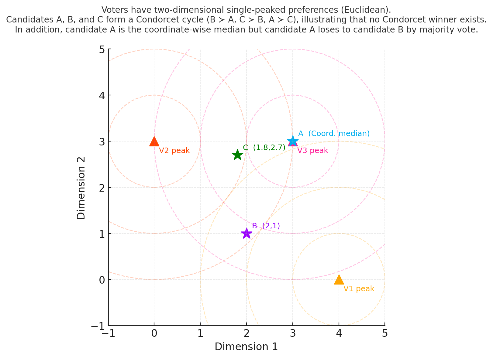

## [📹 Watch the introductory video here](https://wsdmoodle.waseda.jp/mod/quiz/view.php?id=5169784)
# The Median‐Voter Rule

## 1. What Is the Median‑Voter Rule?

In a single‑peaked environment, let every voter cast a **single vote for her peak** (i.e., her most‑preferred option).  
The winner is the **peak of the median voter**—the option that lies at the median of all reported peaks when these peaks are placed on the common one‑dimensional axis.  
We call this procedure the **Median‑Voter Rule (MVR)**.

* **Contrast with other statistics**  
  * A simple plurality rule picks the **mode** (the most frequently chosen option).  
  * The MVR deliberately focuses on the **median**, not the mean, because in a single‑peaked setting the median peak is always the Condorcet winner.

* **Connection to the previous section**  
  * We have already shown that, under single‑peaked preferences, the median voter’s peak **defeats every other alternative in pairwise majority voting**; hence the MVR satisfies the **Condorcet criterion**.

---

## 2. Spoiler Resistance

### 2.1 Claim

Under single‑peaked preferences, the Median‑Voter Rule is **spoiler‑resistant**:  
If introducing a new option changes the winner, then the new option itself must become the winner.  
Equivalently (its contrapositive):

> If an option that is *not* the winner is removed from the ballot, the winner does **not** change.

### 2.2 Sketch of Proof (Contrapositive)

1. Let \(P\) be the current winner (the median peak) and let \(C \neq P\) be any non‑winning option.  
2. Remove \(C\).  
   * Every voter who had chosen \(C\) now shifts her vote to one of \(C\)’s immediate neighbors on the axis (by single‑peakedness).  
3. Because \(C\) is not \(P\), the number of votes **to the left of \(P\)** weakly decreases, the number **to the right of \(P\)** weakly decreases, and votes **at \(P\)** weakly increase.  
4. Hence the median of the multiset of peaks remains \(P\).  
   * The winner is unchanged. ∎

### 2.3 Comparison with Simple Plurality

Even in a single‑peaked world, plurality (mode) is **not** spoiler‑resistant:  
Removing a non‑winning option \(C\) can redirect its supporters to \(C\)’s neighbors, allowing one of them to overtake the previous plurality leader.

---

## 3. Strategy Resistance

### 3.1 Claim

Under single‑peaked preferences, the Median‑Voter Rule is **group strategy‑proof** (sometimes called coalition‑strategy‑proof):

> No coalition of voters can misreport their peaks so that the new winner is strictly better for **every** member of the coalition.

### 3.2 Sketch of Proof (Reductio)

1. Suppose a coalition manipulates the ballot so that the winner changes from \(P\) to \(W\), and every coalition member strictly prefers \(W\) to \(P\).  
2. Assume \(W\) lies **to the right** of \(P\) (the left‑hand case is symmetric).  
   * Then all manipulators’ true peaks must lie weakly to the right of \(P\).  
3. Shifting some reported peaks rightward cannot move the overall median **past the original median** unless at least half of all peaks lie right of \(P\).  
   * But in that case \(P\) would not have been the original median.  
4. Therefore the coalition cannot succeed in moving the winner from \(P\) to a strictly preferred \(W\). ∎

### 3.3 Plurality Again

Under plurality, a coalition can often cast insincere votes to concentrate support on a compromise candidate and defeat the sincere plurality leader.  
The resistance found in the MVR depends crucially on **median selection + single‑peakedness**.

---

## 4. The Special Power of Single‑Peakedness

### 4.1 One Dimension Only

In a one‑dimensional, single‑peaked environment we enjoy, simultaneously:

1. **Guaranteed Condorcet winner**  
2. **Spoiler resistance**  
3. **Group strategy resistance**

The Median‑Voter Rule attains all three.

### 4.2 Higher Dimensions: Trouble Returns

If options are even slightly two‑dimensional:

* A Condorcet winner may fail to exist.  
* No rule can satisfy spoiler resistance and group strategy resistance together (general impossibility results).

### 4.3 Real‑World Relevance

Many political contests are **effectively one‑dimensional** (e.g., left–right ideology).  
In such cases, the median‑voter theorem provides a powerful prediction: **policy converges to the median voter’s ideal point**.  
Of course, when issues are multi‑dimensional, the neat properties above quickly erode, reminding us of the limits of the model.

---

## 5. Key Takeaways

| Property | Median‑Voter Rule (single‑peaked) | Simple Plurality (single‑peaked) |
|----------|----------------------------------|----------------------------------|
| Condorcet criterion | ✅ always satisfied | ❌ can fail |
| Spoiler resistance  | ✅ yes | ❌ no |
| Group strategy‑proof| ✅ yes | ❌ no |

* The **Median‑Voter Rule** exploits the structure of single‑peaked preferences to achieve robustness that is impossible under plurality or in higher‑dimensional issue spaces.
* When real‑world issues are well‑represented by a single ideological line, the median voter wields disproportionate power—both descriptively (predicting outcomes) and normatively (satisfying desirable axioms).

---
### [📝 Take the mini-quiz here](https://wsdmoodle.waseda.jp/mod/quiz/view.php?id=5169784)

