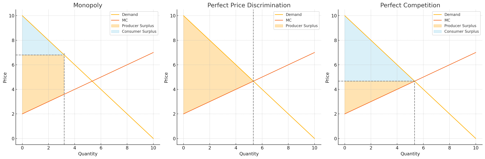

## [📹 Watch the introductory video here](https://wsdmoodle.waseda.jp/mod/quiz/view.php?id=5169778)
# Market Fairness

## 1. The Intuition: “If Opportunities Are Equal, Market Competition Is Fair”

Many people believe that as long as everyone can trade freely on equal terms, the pay‑offs determined in the marketplace must be fair. Indeed, a perfectly competitive equilibrium is efficient and can even yield an envy‑free allocation. But whether it is **the** fairest outcome requires a deeper look. This unit tackles the core of that question from two angles.

---

## 2. Two Conditions That Define a Competitive Equilibrium

### 2.1  “One Price” and “Quantity Chosen by Consent”

An allocation that is a competitive equilibrium satisfies two pillars:

- **(A) Uniform‑price access**  
  Everyone faces exactly the same price for the same good.

- **(B) Voluntary quantity choice**  
  Given that price, each agent freely decides whether to buy (or sell) and is content with the outcome.

When both pillars hold, complaints like “I alone had to pay more” or “I was forced to trade more/less than I wanted” disappear.

### 2.2  What Happens in a One‑Pizza‑Shop Model?

| Scenario | Selling method | Extra amount paid | Intro‑micro prototype |
|----------|---------------|-------------------|----------------------|
| **A & B hold** | ¥1,000 per slice, buy any quantity | ¥0 | Perfect competition |
| **Breaking A** | Students ¥1,300 / Professors ¥1,000 | +¥300 | First‑degree price discrimination |
| **Breaking B** | Flat ¥1,000 but “last 2 slices ¥1,500 each” | +¥500 | Monopoly with quantity restriction |

- **If A is missing**, price discrimination creates a surcharge.  
- **If B is missing**, tying or quantity threats create surcharges *and* deadweight loss.  
- **Only the row where both A and B hold** has zero mark‑up and zero inefficiency.

### 2.3  How the Two Pillars Eliminate Mark‑ups

(A) removes the possibility that the same good sells at different prices; (B) renders forced quantities or bundling ineffective. A competitive price therefore guarantees that **no one is made worse off by being singled out.**

---

## 3. “Coalitions Cannot Gain by Deviating” — The Two Pillars and Core Convergence

The decisive reason the two pillars can be called *the fairest* is the **Core Convergence Theorem**:

> **If every type of consumer and firm is replicated in the same proportions so the economy grows without bound, the set of core allocations (those that no coalition can block) converges to the competitive equilibria that satisfy the two pillars.**

### 3.1  What Happens in a Replica Economy?

Suppose we enlarge the economy by many replicas. If an allocation **breaks pillar A** (same good, different prices), the consumer paying the highest price can approach another firm and propose, “Sell to me a bit above what you charge your other customers but still below the price I’m currently paying.” With enough replicas such firms are plentiful, and high‑price consumers defect.  

If an allocation **breaks pillar B** (forced quantities/tying), agents suffering the threat can team up with replica partners who are *not* constrained and re‑route trade. In both cases the original allocation unravels.

### 3.2  Why the Two Pillars Erase Every Coalition’s Blueprint

- **Single price**: In the replica world there is no “lower price” to copy; a price‑copying plan cannot even be drawn.  
- **Freedom not to trade**: A tying threat meets the response “No, thanks,” killing any quantity‑based plan.

Thus **only allocations that satisfy uniform price *and* voluntary choice** survive coalition deviations no matter how large the replica economy. That is the core convergence theorem’s punchline and the formal backing for saying *competitive prices do not exploit anyone’s lack of outside options*.

---

## 4. Other Notions of Fairness May Disagree

Perfect competition guarantees **the minimal fairness of not exploiting scarcity**, but the actual division can still be highly unequal, depending on demand and supply elasticities or initial endowments. In a market for life‑saving drugs with inelastic demand, consumer surplus may be small; in a market for rare minerals with inelastic supply, producer surplus may shrink. Outcomes shift with market structure.

- **View ①** — Rewards should reflect social importance.  
- **View ②** — Rewards should be proportional to labor effort.

From either viewpoint, a competitive outcome may fall short of fairness. Questions of income inequality and redistribution therefore remain tasks for policies outside the market (taxation, social security, public services).

---

## 5. Five‑Line Take‑away

1. A competitive equilibrium satisfies **(A) uniform‑price access** and **(B) voluntary quantity choice** simultaneously.  
2. These two pillars block price discrimination and quantity threats, erasing scarcity mark‑ups.  
3. Allocations that lack either pillar collapse under coalition deviation, leaving only competitive equilibria — **Core Convergence Theorem**.  
4. Competitive prices represent pay‑offs that *do not exploit anyone’s absence of alternatives*.  
5. Whether the resulting distribution is *just* depends on supplemental redistribution mechanisms, not on the market itself.

---

### [📝 Take the mini-quiz here](https://wsdmoodle.waseda.jp/mod/quiz/view.php?id=5169778)

